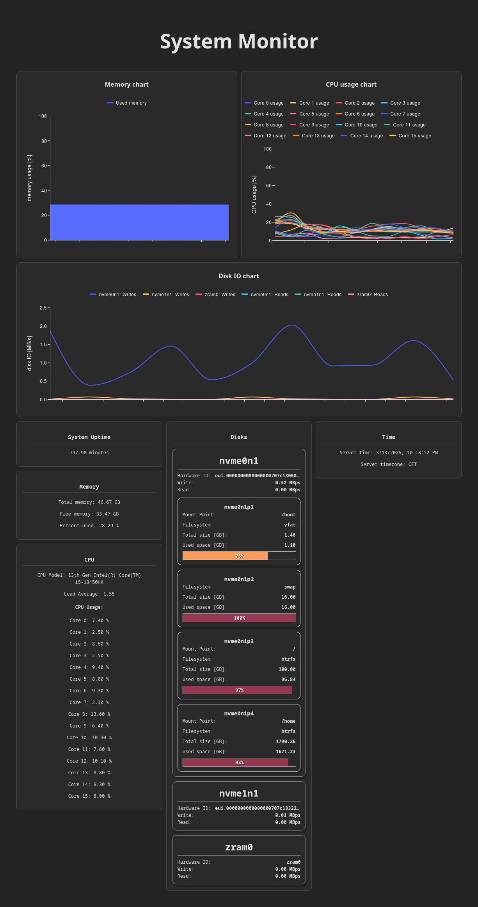

# Simple System Monitor

This application shows statistics from the host server (uptime, memory, CPU).
The backend uses Django to implement a REST API, and the frontend is written in React. The statistics are read from `/proc`.



## Running the application

Use `docker compose` to run the application:

``` sh
docker compose up --build
```

The frontend should now be accessible at ```http://localhost:5173```.
