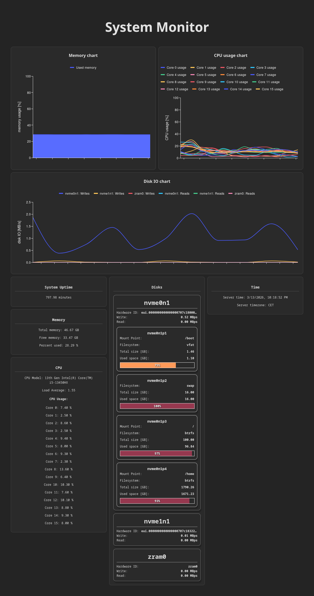

# System Monitor

This application shows statistics from the host server (uptime, memory, CPU).
The backend uses Django to implement a REST API, and the frontend is written in React.



## Running the application

First, you will need to set the DJANGO_SECRET environmental variable in a .env file. Rename the provided example file and change the DJANGO_SECRET variable inside.

``` sh
mv .env.example .env
```

Second, use `docker compose` to launch the application. 

``` sh
docker compose up --build
```

Then you will need to create a user account to log in. You can use a superuser account.

``` sh
docker exec -it <backend container id> /bin/bash
python manage.py createsuperuser
```

The frontend should now be accessible at ```http://localhost:5173```.
